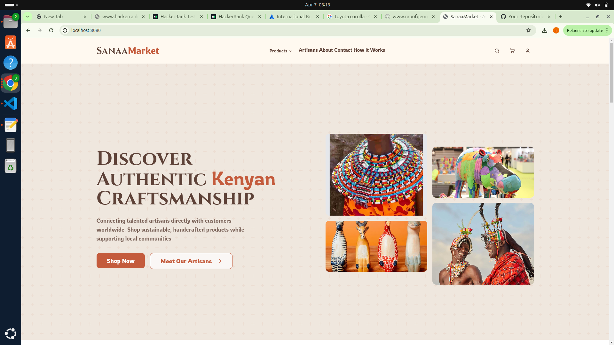
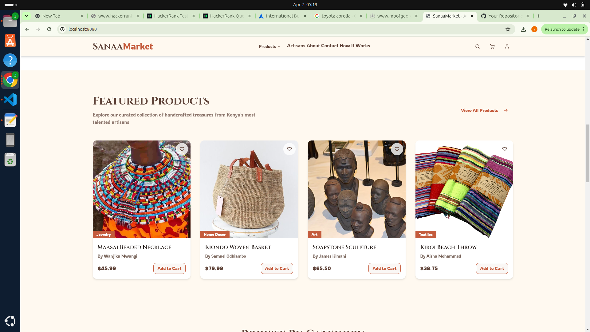
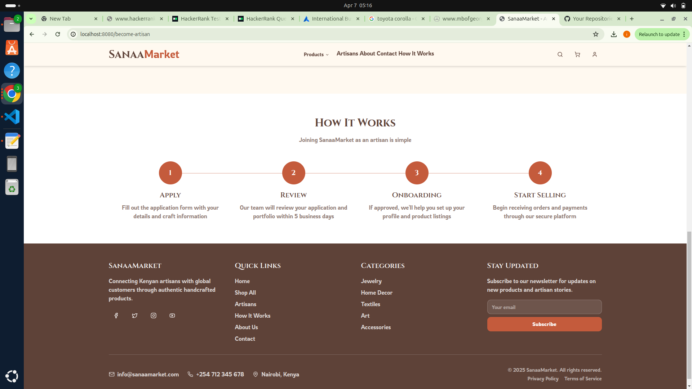
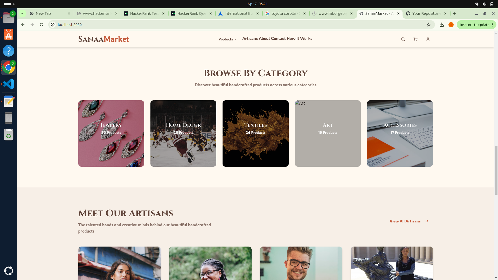
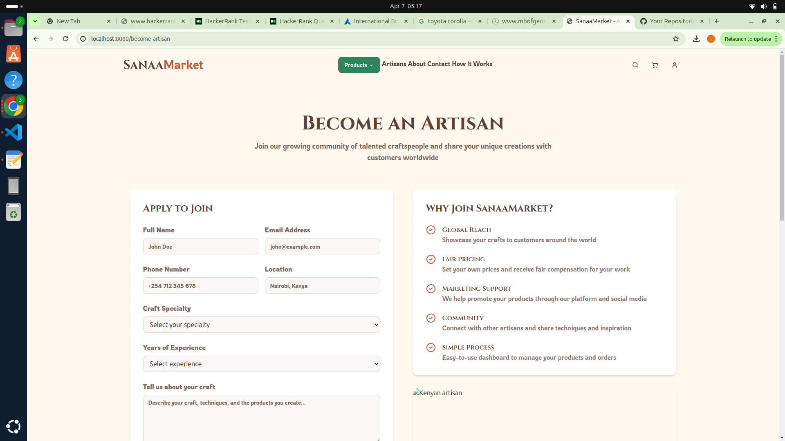

# Kenyan Market Explorer Genesis    

## Project Info 






## About

This is the main repository for the Kenyan Market Explorer Genesis project. It contains the code for the Kenyan Market Explorer Genesis website.

## Installation

To install the project, you will need to have [Node.js](https://nodejs.org/en/) installed on your computer. Once you have Node.js installed, you can install the project dependencies by running the following command in the terminal:

```
npm install
```

## Usage

To start the project, you can run the following command in the terminal:

```
npm start
```

This will start the project on your local machine and open the website in your default browser.

## Contributing

If you would like to contribute to the project, you can submit a pull request with your changes.

